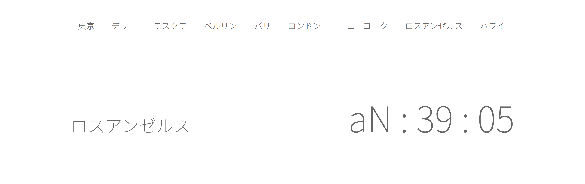

# Firefox 開発ツールハンズオン デバッガ編

Mozilla Japan 

清水智公 (nshimizu@mozilla-japan.org)

---

## 脱 console.log

* デバッガの持つ機能を一通り紹介します
* プログラムの振る舞いの追跡方法について学びます
* 事前条件、事後条件の確認方法についても学びます

---

## 清水智公 / [@chikoski](https://twitter.com/chikoski/)

* Mozilla Japan で Dev-rel やっています
* プログラミング言語とサッカーが好きです 
* [html5experts.jp](https://html5experts.jp/chikoski/) で記事をいくつか書いています
* html5j Web プラットフォーム部 / ゲーム部

---

----

## Firefox Developer Edition

* 開発者向けのブラウザです
* 開発ツールがリリース版よりも充実しています
* リリース版とは別のプロファイルで動作します
* 詳しい機能は [Web サイト](https://www.mozilla.org/firefox/developer/)をご覧ください 

---

## Firefox 開発ツールの起動

----

### 開発ツールの設定

* 表示するタブやテーマを変更できます
* 以降は "Light" テーマを利用します

---

## JavaScript デバッガ

* 開発ツールの機能で、JavaScript のデバッグ作業に役立ちます
* 主な機能
    * ブレークポイントの設置
    * コードのステップ実行
    * 変数の調査、編集、ウォッチ
* 詳しい解説は [MDN のページ](https://developer.mozilla.org/ja/docs/Tools/Debugger)をご覧くださいs

---

## デバッガの起動

----

### デバッガの UI

---

## ブレークポイント

* ブレークポイント：実行を停止したい行
* プログラムがブレークポイントへ到達したら、そこで実行が止まります
* ソースペインで行をクリックすることで、設置できます

----

### ブレークポイントを設定するべき場所は？

* 変数の値を確認したい場所
* プログラムの振る舞いを追いたい場所

---

## 変数ペイン：変数の値の確認

* 変数ペインに、変数とその値が表示されます
* 変数はスコープごとにまとまって表示されています

---

## 式のウオッチ

* ウォッチ式：実行が停止するたびに評価される式
* 変数ペインから設定します
* コード内で調査できない値を調査するのに使えます

---

## ステップ実行

* プログラムを 1 行ずつ実行することです
* デバッガの左上のボタンを使用します

----

## ステップ実行でできること

* 復帰：次のブレークポイントまで実行します
* ステップオーバー：同じ関数内で次の行へ進みます
* ステップイン：その行が
  * 関数呼び出しでない場合：次の行へ進みます
  * 関数呼び出しの場合：呼び出した関数へ入ります
* ステップアウト：現在の関数の終りまで実行します  

---

## 検索

* ツールバーの検索欄でスクリプトをキーワード検索ができます
* 接頭辞をつけることで、様々な検索が可能です

----

### 検索で利用できる接頭辞

|接頭辞|機能|
|-----|---|
|なし|ソースリストペインに表示されているスクリプトの絞り込み|
|!|すべてのファイルに対する文字列検索|
|@|指定した文字列を含む関数定義の検索|
|#|現在ソースペインで開いているファイルに対する文字列検索|
|:|ソースペインで開いているファイルの指定行への移動|
|*|変数ペインに表示している変数の絞り込み|

---

## 条件付きブレークポイント

* 特定の条件を満たす時だけ実行が停止するブレークポイント
* 設置したい行で開くコンテキストメニューから設置

----

### 条件の設定方法

* ポップアップに条件を記入します
* 条件は評価値が真偽値になるような式で表現します
* この式が true に評価された時に、実行が停止します

----

### 条件付きブレークポイント

----

### 条件の変更

---

## DOM イベントでのブレーク

---

## ここまでのまとめ

* ブレークポイントを適切に設定します
  * 条件付きブレークポイント
  * DOM イベントでのブレーク  
* 変数やウォッチ式の値を確認しつつ
* ステップ実行で、プログラムの振る舞いを確認します

---

## TIPS：エラーの解説ページ

* コンソールに表示されるエラーには「詳細」がつくものがあります
* 詳細をクリックすると MDN のエラー解説ページが表示されます

----

### MDN のエラー解説ページ

---

## デバッグを体験しよう

* world-clock/app フォルダ内にアプリがあります
* フォルダ内の index.html を開いてください

----

### ローカルでサーバーを立てるには 

~~~sh
% cd world-clock
% npm install
% gulp
~~~

* [Gulp](http://gulpjs.com/) が使えれば、ローカルでサーバが立てられます。
* 上記のコマンドで [localhost:8888](http:localhost:8888/) でサーバーが動きます

----

### シナリオ：都市が正しく変わらない

* 地名をクリックすると、必ず「ハワイ」の時間が表示されます 
* これを修正してください 

----

### シナリオ：表示が崩れる

* デリーの時だけ、時刻の表示が崩れます
* これを修正してください

----

### シナリオ：不正に計算される時刻

* 時刻が不正に計算されます
* サンフランシスコをクリックすると発生します

---

## まとめ

* デバッガを使うと、コードを変えなくても、コードの振る舞いや状態を追えます
* ブレークポイントをどう設定するかが鍵です
* 今日扱わなかったトピック
  * altJS で出力されたコードのデバッグ
  * 難読化されたコードのデバッグ
  * Chrome で動作するコードのデバッグ
  * Android / iOS 上で動作するコードに対するデバッグ